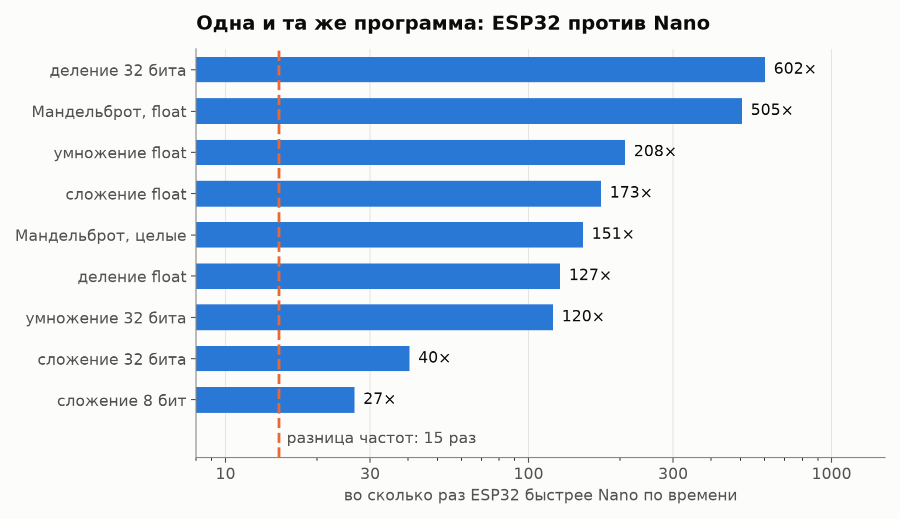
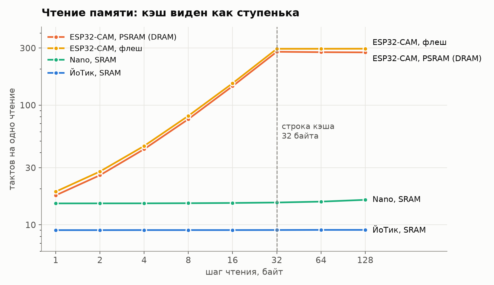
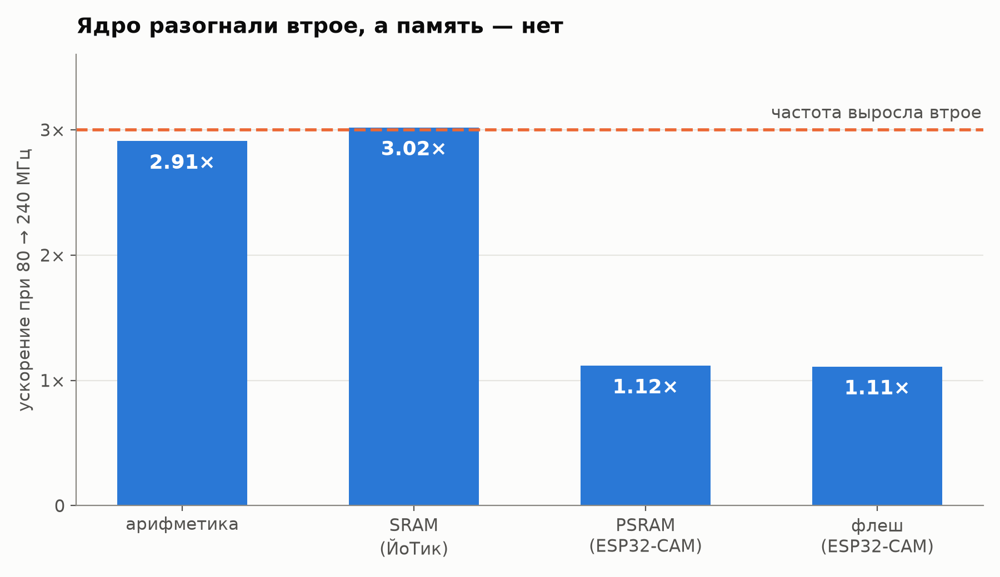

# Одна программа, три процессора

Один и тот же скетч прошит в три платы: Arduino Nano (AVR, 8 бит, 16 МГц),
ЙоТик-32 и ESP32-CAM (Xtensa LX6, 32 бита, до 240 МГц). Он измеряет, сколько
тактов уходит на операции, вызовы функций и чтение разных видов памяти.

---

## Результаты работы

Сырой вывод всех плат, таблица и графики: **[папка Results](Results/)**

### 1. Частота отличается в 15 раз, а скорость — от 27 до 600 раз



| операция | Nano, тактов | ESP32, тактов | ESP32 быстрее по времени |
|---|---|---|---|
| сложение 8 бит | 30 | 17 | 27× |
| сложение 32 бита | 35 | 13 | 40× |
| умножение 32 бита | 105 | 13 | 120× |
| деление 32 бита | 645 | 16 | 602× |
| умножение float | 181 | 13 | 208× |

Мандельброт 48×16 во float: 817,7 мс на Nano против 1,6 мс на ESP32 — в 505 раз.

- 32-битное число AVR складывает за 4 команды по байту, перенос идёт через флаг
  (см. [дизассемблер](Results/disasm_chain.txt)).
- У AVR нет команды деления и блока плавающей точки — их заменяет подпрограмма.
- На Nano Мандельброт в целых числах (8.8) в 4,8 раза быстрее, чем во float.
- Такты на ESP32 включают барьеры `memw` вокруг переменных `volatile`, поэтому
  сложение, умножение и float там неотличимы: сама операция занимает около такта.

### 2. Кэш виден как ступенька на 32 байтах



- Внутренняя SRAM ESP32 — около 9 тактов на чтение при любом шаге.
- У Nano кэша нет, линия ровная.
- PSRAM (внешняя DRAM) и флеш растут с шагом и выходят на полку с шага 32 байта —
  это длина строки кэша. Промах в PSRAM ≈ 270 тактов ≈ 1,1 мкс.

### 3. Частоту подняли втрое, а внешняя память ускорилась на 11 %



| при 80 → 240 МГц | ускорение |
|---|---|
| арифметика | 2,91× |
| SRAM (ЙоТик) | 3,02× |
| PSRAM (ESP32-CAM) | 1,12× |
| флеш (ESP32-CAM) | 1,11× |

### Прочее

- Вызов функции: на ESP32 глубокая рекурсия дороже одиночного вызова
  (59 и 34 такта) — сбрасываются регистровые окна. На Nano разницы нет.
- `double` на ESP32 считается программно (128 тактов против 13 у `float`),
  на Nano `double` — это тот же `float`.
- На ESP32 байтовые переменные медленнее 32-битных: нужны команды `l8ui` и `sext`.
- Запись байта EEPROM на Nano ≈ 3,3 мс.
- Открытый вопрос: SRAM на ESP32-CAM при разгоне ускорилась в 2,4 раза, а не в 3,
  как на ЙоТике.

Каждая плата прогнана дважды, расхождение меньше 0,1 %.

---

## Состав

```
code/bench/bench.ino    скетч с тестами, один для всех плат
code/analyze.py         разбор вывода, таблица и графики
Results/                вывод плат, summary.csv, графики, дизассемблер
```

---

## Как повторить

```
Nano:       arduino:avr:nano            ядро arduino:avr 1.8.8
ЙоТик-32:   esp32:esp32:esp32           ядро esp32:esp32 3.3.11
ESP32-CAM:  esp32:esp32:esp32cam
```

1. Прошить `code/bench/bench.ino`, открыть монитор порта на 115200.
2. Дождаться строки `# готово`, скопировать вывод в `Results/raw_exploreit.txt`.
3. `python code/analyze.py` (нужен matplotlib) — пересоберёт таблицу и графики.

Формат вывода: `плата;тест;операций;время_мкс;тактов_на_операцию`.
